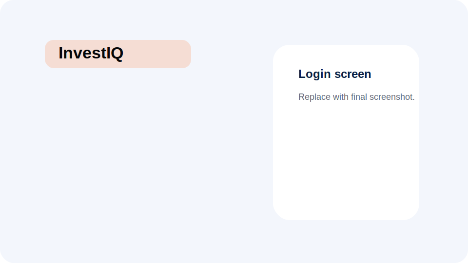
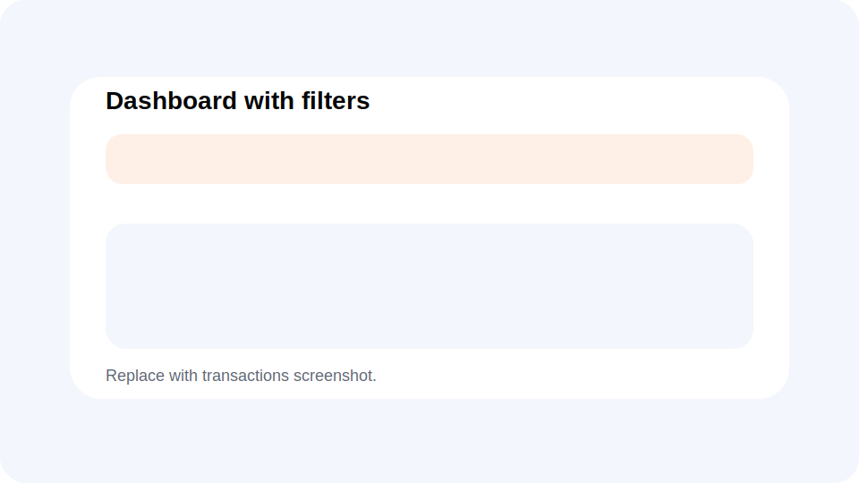
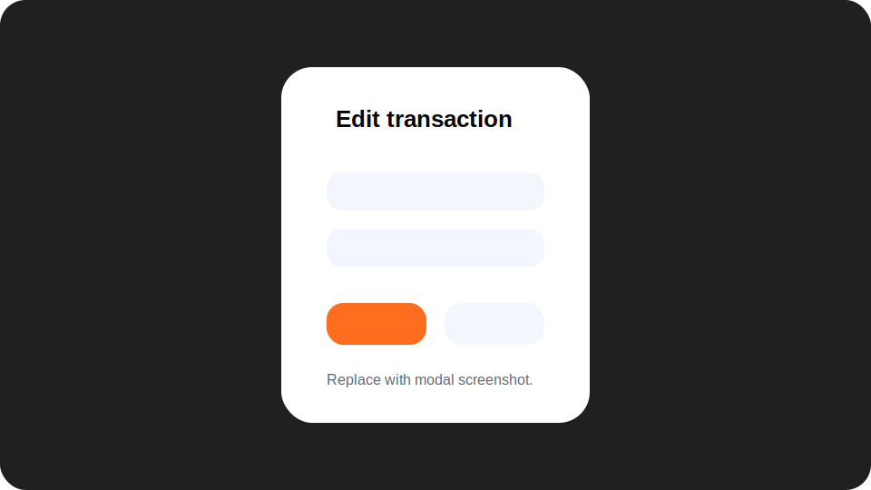
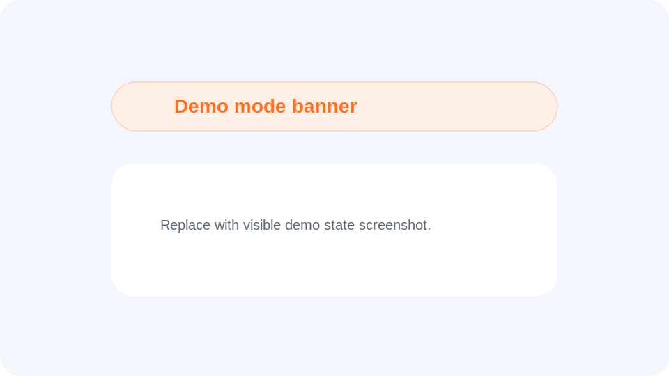

# InvestIQ

InvestIQ is a personal finance tracker built with React, TypeScript, Vite, Firebase Auth, and Firestore. It helps users track income, expenses, baseline balance, monthly summaries, and category-based reports in a polished Ukrainian-language interface.

This project is designed as a portfolio-ready frontend application: it includes real authentication, per-user cloud data, typed finance utilities, responsive UI, local demo access, and test coverage for the core money/reporting logic.

## Live Demo

- **Production:** [https://pizzaman333.github.io/investiq/](https://pizzaman333.github.io/investiq/)
- **Demo access:** click **“Спробувати демо без реєстрації”** on the login screen.

The demo mode uses local seeded data only. It does not expose personal data, does not require Firebase login, and may reset when the session is refreshed or reopened.

## Screenshots

Placeholder screenshots live in [`docs/screenshots`](docs/screenshots). Replace them with real captures before sharing the project widely.

| Screen | Preview |
| --- | --- |
| Login / welcome page |  |
| Dashboard with filters |  |
| Edit transaction modal |  |
| Reports page |  |
| Demo mode banner |  |

## Features

- Firebase email/password authentication and Google redirect sign-in.
- Guest-safe local demo mode with seeded finance data.
- Protected routes for dashboard and reports.
- Firestore-backed per-user finance state and transaction history.
- Baseline balance confirmation and calculated current balance.
- Income and expense transaction creation, editing, and deletion.
- Client-side dashboard filters by month, type, category, and description.
- Monthly summary panel and responsive transaction table/list.
- Reports with income-vs-expense comparison, top categories, category grid, and chart breakdown by description.
- Ukrainian UI text, UAH formatting, and integer-cent money calculations.
- CSS Modules, tokenized global styles, and inline SVG icons with hover/active states.

## Tech Stack

- **React 19** and **TypeScript**
- **Vite** with GitHub Pages deployment support
- **React Router** for route guards and SPA navigation
- **Formik** for forms and validation
- **Firebase Auth** for authentication
- **Firestore** for per-user finance data
- **CSS Modules** for component styling
- **vite-plugin-svgr** for styleable SVG icons
- **Vitest** for utility tests

## Architecture Overview

The app is organized around feature ownership while keeping reusable UI in shared layers:

```text
src/
  app/                 router and app providers
  layouts/             authenticated and auth page layouts
  pages/               route-level dashboard/report/welcome pages
  features/
    auth/              Firebase auth context and forms
    demo/              local recruiter demo state
    finance/           finance state hooks/services
    transactions/      forms, table, services, utilities
    reports/           report components and derived data
  shared/              constants, types, Firebase setup, UI primitives
  styles/              reset, variables, global styles
```

Firestore remains the source of truth for real authenticated accounts. Demo mode is intentionally separate and local so recruiters can inspect the UI without creating an account.

## Firebase And Security

This is a Vite frontend app, so `VITE_*` environment variables are included in the client bundle. Firebase web config values identify the Firebase project; they are not treated as server secrets.

Security is handled through:

- Firebase Authentication providers.
- Firestore Security Rules that restrict each user to `users/{uid}`.
- Authorized domains in Firebase Authentication settings.
- Optional Google Cloud API key restrictions.
- Future hardening with Firebase App Check.

Important: committing `firestore.rules` does not deploy it. Deploy or paste the rules in the Firebase Console before using the app with real users.

## Firestore Data Model

```text
users/{uid}
  uid: string
  email: string | null
  displayName: string | null
  photoURL: string | null
  createdAt
  updatedAt

users/{uid}/finance/state
  currency: "UAH"
  baseBalanceCents: number
  balanceConfirmed: boolean
  createdAt
  updatedAt

users/{uid}/transactions/{transactionId}
  id: string
  kind: "expense" | "income"
  date: string
  monthKey: string
  description: string
  categoryId: string
  categoryName: string
  amountCents: number
  currency: "UAH"
  createdAt
  updatedAt
```

Money is stored and calculated as integer cents/kopiykas, never floating point values.

## Local Setup

1. Install dependencies:

   ```bash
   npm install
   ```

2. Copy the environment template:

   ```bash
   cp .env.example .env
   ```

3. Add Firebase web app values to `.env`:

   ```text
   VITE_FIREBASE_API_KEY=
   VITE_FIREBASE_AUTH_DOMAIN=
   VITE_FIREBASE_PROJECT_ID=
   VITE_FIREBASE_STORAGE_BUCKET=
   VITE_FIREBASE_MESSAGING_SENDER_ID=
   VITE_FIREBASE_APP_ID=
   ```

4. Start the app:

   ```bash
   npm run dev
   ```

`.env` and `.env.*` are ignored by Git. Keep `.env.example` as placeholders only.

## Available Scripts

```bash
npm run dev      # start Vite dev server
npm run build    # TypeScript build + production bundle
npm run lint     # run ESLint
npm run test     # run Vitest
npm run preview  # preview production build locally
npm run deploy   # build and publish dist/ to GitHub Pages
```

The `postbuild` script copies `dist/index.html` to `dist/404.html` so GitHub Pages can support SPA refreshes under `/investiq/`.

## Deployment Notes

- `homepage` is configured for GitHub Pages: `https://pizzaman333.github.io/investiq/`.
- Vite uses `BASE_URL` in the router basename, so production routes work under `/investiq/`.
- Firebase Auth authorized domains should include localhost, `127.0.0.1`, and the deployed GitHub Pages domain.
- Firestore rules must be published separately through Firebase Console or Firebase CLI.

## Testing Notes

Core finance logic is covered with Vitest:

- Money parsing and formatting.
- Date and month helpers.
- Current balance calculations.
- Monthly totals and category/report aggregation.
- Transaction filtering.

Firebase itself is not unit-tested directly in this project; the app keeps Firestore calls behind services and tests pure utilities where possible.

## Future Improvements

- Add Firebase App Check for stronger abuse protection.
- Add richer report charts and export options.
- Add account settings and profile management.
- Add transaction import/export.
- Add recurring transactions and budgets.
- Replace screenshot placeholders with final production screenshots.

## What I Learned

- How to model finance data safely with integer cents instead of floats.
- How to combine Firebase Auth, Firestore subscriptions, and route protection in a frontend-only app.
- How to keep mock/demo behavior separate from real persistent data.
- How to build responsive UI with CSS Modules and reusable typed components.
- How to turn SVG assets into interactive React components with `vite-plugin-svgr`.
